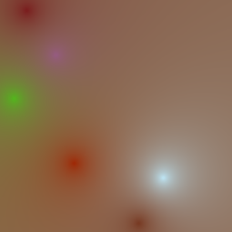
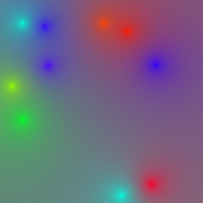
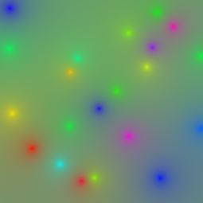
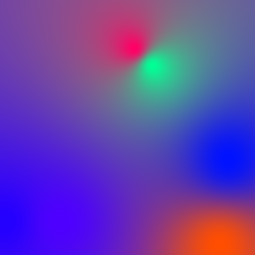
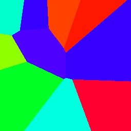
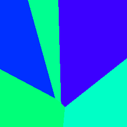
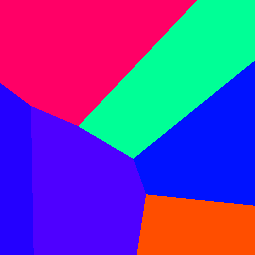
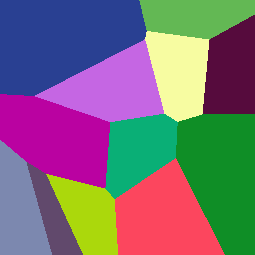
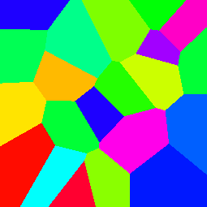

# vizsum

A generative image exercise for converting checksum data into something visual.
ImageMagick's sparse-color interpolation methods are used to create stunning
unique images.

**How this works**

Take the following message digest

    echo -n emcconville | md5
    #=> 8a59b44064a204d569feec76645a6dcb

This project proposes that the data generated by a digest can map to a Pixel
data structure.

    ,---- X coordinate
    ||,-- Y coordinate
    ||||
    8a59b44064a204d569feec76645a6dcb
        |     |
        `-----+- color value

Or even a Hue only degree value.

    ,---- X coordinate
    ||,-- Y coordinate
    ||||
    8a59b44064a204d569feec76645a6dcb
        ||
        `-- hue angle

So any digest blob can _(unsafely)_ be cast to a C data structure

~~~c
struct pixel {
    struct coord {
        unsigned char x,y
    },
    struct color {
        unsigned char r,g,b
    } // or hue 
}
~~~

Scaling bytes against quantum colors results in some truly unique points of color.
See below for examples of diffrent ImageMagick Interpolation of each color.

## Barycentric Interpolate (default)

    echo -n emcconville | vizsum -barycentric sumimg.png

Adler32 _-adler32_

GOST _-gost_

MD5 _-md5_ (default)

SHA1 _-sha1_

WHIRLPOOL _-whirlpool_

### Hue only

    echo -n emcconville | vizsum -barycentric -hue sumimg.png

Adler32 _-adler32_

GOST _-gost_

MD5 _-md5_ (default)

SHA1 _-sha1_

WHIRLPOOL _-whirlpool_

## Bilinear Interpolate

    echo -n emcconville | vizsum -bilinear sumimg.png

Adler32 _-adler32_

GOST _-gost_

MD5 _-md5_ (default)

SHA1 _-sha1_

WHIRLPOOL _-whirlpool_

### Hue only

    echo -n emcconville | vizsum -bilinear -hue sumimg.png

Adler32 _-adler32_

GOST _-gost_

MD5 _-md5_ (default)

SHA1 _-sha1_

WHIRLPOOL _-whirlpool_

## Inverse Interpolate

    echo -n emcconville | vizsum -inverse sumimg.png

Adler32 _-adler32_

GOST _-gost_

MD5 _-md5_ (default)

SHA1 _-sha1_

WHIRLPOOL _-whirlpool_

### Hue only

    echo -n emcconville | vizsum -inverse -hue sumimg.png

Adler32 _-adler32_

GOST _-gost_

MD5 _-md5_ (default)

SHA1 _-sha1_

WHIRLPOOL _-whirlpool_

## Shepards Interpolate

    echo -n emcconville | vizsum -shepards sumimg.png

Adler32 _-adler32_

GOST _-gost_

MD5 _-md5_ (default)

SHA1 _-sha1_

WHIRLPOOL _-whirlpool_

### Hue only

    echo -n emcconville | vizsum -shepards -hue sumimg.png

Adler32 _-adler32_

GOST _-gost_

MD5 _-md5_ (default)

SHA1 _-sha1_

WHIRLPOOL _-whirlpool_

## Voronoi Interpolate

    echo -n emcconville | vizsum -voronoi sumimg.png

| Digest | Flag | Hue only |
|--------|------|----------|
| Adler32 | `-voronoi -adler32` | `-voronoi -adler32 -hue` |
| |  |  |
| GOST | `-voronoi -gost` | `-voronoi -gost -hue` |
| |  |  |
| MD5 | `-voronoi -md5` | `-voronoi -md5 -hue` |
| |  |  |
| SHA1 | `-voronoi -sha1` | `-voronoi -sha1 -hue` |
| |  |  |
| WHIRLPOOL | `-voronoi -whirlpool` | `-voronoi -whirlpool -hue` |
| |  |  |

# _&#64257;n_

Suggestions, comments, and requests are [welcome](https://github.com/emcconville/VizSum/issues).

