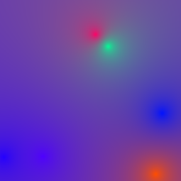
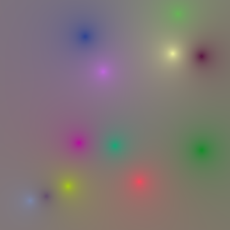
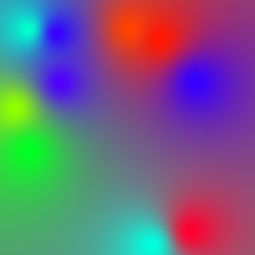

# vizsum

A generative image exercise for converting checksum data into something visual.
ImageMagick's sparse-color interpolation methods are used to create stunning
unique images.

**How this works**

Take the following message digest

    echo -n emcconville | md5
    #=> 8a59b44064a204d569feec76645a6dcb

This project proposes that the data generated by a digest can map to a Pixel
data structure.

    ,---- X coordinate
    ||,-- Y coordinate
    ||||
    8a59b44064a204d569feec76645a6dcb
        |     |
        `-----+- color value

Or even a Hue only degree value.

    ,---- X coordinate
    ||,-- Y coordinate
    ||||
    8a59b44064a204d569feec76645a6dcb
        ||
        `-- hue angle

So any digest blob can _(unsafely)_ be cast to a C data structure

~~~c
struct pixel {
    struct coord {
        unsigned char x,y
    },
    struct color {
        unsigned char r,g,b
    } // or hue 
}
~~~

Scaling bytes against quantum colors results in some truly unique points of color.
See below for examples of diffrent ImageMagick Interpolation of each color.

## Barycentric Interpolate (default)

    echo -n emcconville | vizsum -barycentric sumimg.png

| Digest  | Flag | Hue only |
|---------|------|----------|
| Adler32 | `-barycentric -adler32` | `-barycentric -adler32 -hue` |
|         |  |  |
| GOST    | `-barycentric -gost` | `-barycentric -gost -hue` |
|         |  |  |
| MD5     | `-barycentric -md5` | `-barycentric -md5 -hue` |
|         |  |  |
| SHA1    | `-barycentric -sha1` | `-barycentric -sha1 -hue` |
|         |  |  |
| WHIRLPOOL | `-barycentric -whirlpool` | `-barycentric -whirlpool -hue` |
|         |  |  |

## Bilinear Interpolate

    echo -n emcconville | vizsum -bilinear sumimg.png

| Digest  | Flag                                    | Hue only |
|---------|-----------------------------------------|----------|
| Adler32 | `-bilinear -adler32`                    | `-bilinear -adler32 -hue` |
|         |  |  |
| GOST    | `-bilinear -gost`                       | `-bilinear -gost -hue` |
|         |        |  |
| MD5     | `-bilinear -md5`                        | `-bilinear -md5 -hue` |
|         |          |  |
| SHA1    | `-bilinear -sha1`                       | `-bilinear -sha1 -hue` |
|         |        |  |
| WHIRLPOOL | `-bilinear -whirlpool`                | `-bilinear -whirlpool -hue` |
|         |  |  |

## Inverse Interpolate

    echo -n emcconville | vizsum -inverse sumimg.png

| Digest  | Flag                                   | Hue only |
|---------|----------------------------------------|----------|
| Adler32 | `-inverse -adler32`                    | `-inverse -adler32 -hue` |
|         |  |  |
| GOST    | `-inverse -gost`                       | `-inverse -gost -hue` |
|         |        |  |
| MD5     | `-inverse -md5`                        | `-inverse -md5 -hue` |
|         |          |  |
| SHA1    | `-inverse -sha1`                       | `-inverse -sha1 -hue` |
|         |        |  |
| WHIRLPOOL | `-inverse -whirlpool`                | `-inverse -whirlpool -hue` |
|         |  |  |

## Shepards Interpolate

    echo -n emcconville | vizsum -shepards sumimg.png

| Digest  | Flag                                    | Hue only |
|---------|-----------------------------------------|----------|
| Adler32 | `-shepards -adler32`                    | `-shepards -adler32 -hue` |
|         |  |  |
| GOST    | `-shepards -gost`                       | `-shepards -gost -hue` |
|         |        |  |
| MD5     | `-shepards -md5`                        | `-shepards -md5 -hue` |
|         |          |  |
| SHA1    | `-shepards -sha1`                       | `-shepards -sha1 -hue` |
|         |        |  |
| WHIRLPOOL | `-shepards -whirlpool`                | `-shepards -whirlpool -hue` |
|         |  |  |

## Voronoi Interpolate

    echo -n emcconville | vizsum -voronoi sumimg.png

| Digest  | Flag                                   | Hue only |
|---------|----------------------------------------|----------|
| Adler32 | `-voronoi -adler32`                    | `-voronoi -adler32 -hue` |
|         |  |  |
| GOST    | `-voronoi -gost`                       | `-voronoi -gost -hue` |
|         |        |  |
| MD5     | `-voronoi -md5`                        | `-voronoi -md5 -hue` |
|         |          |  |
| SHA1    | `-voronoi -sha1`                       | `-voronoi -sha1 -hue` |
|         |        |  |
| WHIRLPOOL | `-voronoi -whirlpool`                | `-voronoi -whirlpool -hue` |
|         |  |  |

# _&#64257;n_

Suggestions, comments, and requests are [welcome](https://github.com/emcconville/VizSum/issues).

